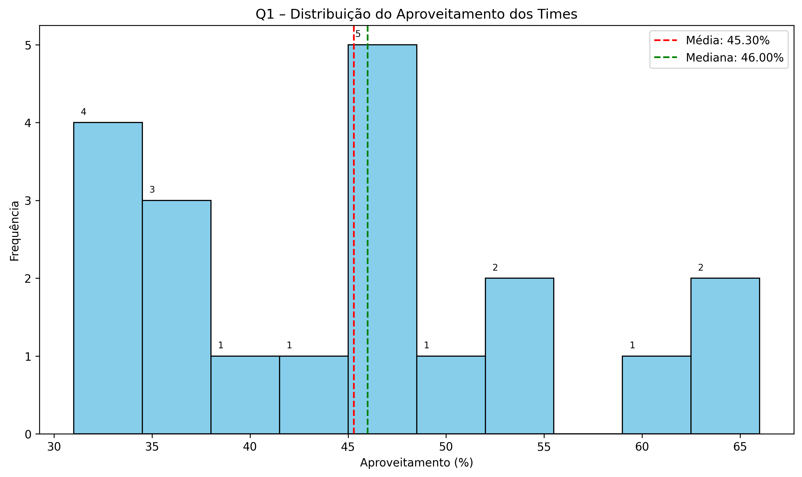
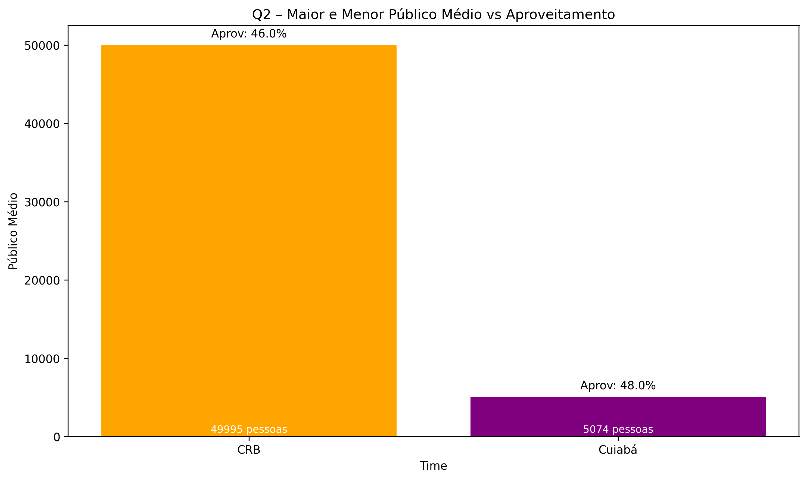
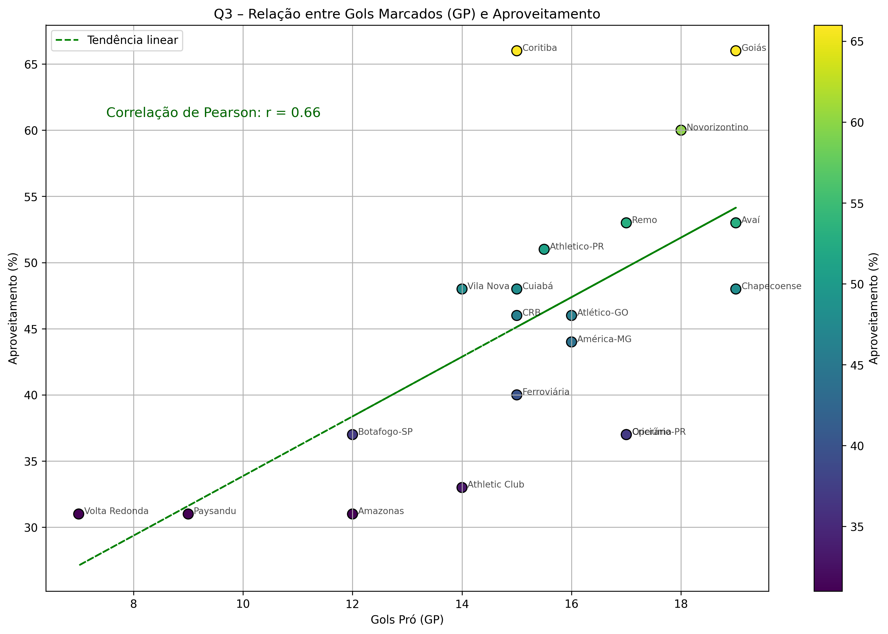

# Análise de Dados - Série B do Campeonato Brasileiro

## Objetivo do Projeto

Este projeto realiza uma análise dos dados da 15 rodada da Série B do Campeonato Brasileiro de Futebol, com foco em três aspectos principais:

1. **Distribuição do aproveitamento dos times** - Análise estatística descritiva
2. **Relação entre público e desempenho** - Comparação entre times com maior e menor torcida
3. **Correlação entre gols marcados e aproveitamento** - Análise da eficiência ofensiva

O objetivo é identificar padrões, tendências e insights que possam explicar o desempenho dos times no campeonato, utilizando técnicas de ciência de dados e visualização.

## Estrutura do Projeto

```
futebol-serie-b-analise/
├── dataset/                              # Dados do projeto
│   ├── dataset.csv                       # Dataset original
│   ├── dataset_corrigido.csv            # Dataset após limpeza
│   ├── dataset_novo_atributo.csv        # Dataset com atributo "Público"
│   └── dataset_reduzido.csv             # Dataset reduzido (G4 e Z4)
├── docs/                                # Documentação
│   ├── etapas.txt                       # Documentação das etapas
│   └── report.txt                       # Relatório analítico detalhado
├── plots/                               # Visualizações geradas
│   ├── grafico_q1_histograma_aproveitamento.png  # Gráfico Q1
│   ├── grafico_q2_publico_aproveitamento.png     # Gráfico Q2
│   └── grafico_q3_gols_aproveitamento.png        # Gráfico Q3
├── exploracao.py                        # Exploração inicial dos dados
├── limpeza.py                          # Pré-processamento e limpeza
├── transformacao.py                    # Transformações e agregações
├── visualizacao.py                     # Geração de gráficos
├── requirements.txt                    # Dependências do projeto
├── .gitignore                         # Arquivos ignorados pelo Git
└── README.md                          # Este arquivo
```

## Dataset e Variáveis

### Fonte dos Dados
O dataset contém informações estatísticas dos times participantes da Série B do Campeonato Brasileiro.

### Variáveis Principais

| Variável | Tipo | Descrição |
|----------|------|-----------|
| **Time** | Categórica | Nome do time |
| **Pontos** | Numérica | Pontos conquistados no campeonato |
| **Aproveitamento** | Numérica | Percentual de aproveitamento (pontos/total possível) |
| **GP (Gols Pró)** | Numérica | Total de gols marcados |
| **GC (Gols Contra)** | Numérica | Total de gols sofridos |
| **Público** | Numérica | Público médio por jogo (gerado artificialmente) |
| **Faixa** | Categórica | Classificação em G4 (melhores) ou Z4 (piores) |

## Tecnologias e Dependências

### Linguagem e Ambiente
- **Python 3.13.2**
- **Ambiente Virtual** (.venv)

### Bibliotecas Utilizadas

| Biblioteca | Versão | Função |
|------------|--------|--------|
| **pandas** | 2.3.1 | Manipulação e análise de dados |
| **numpy** | 2.3.2 | Operações matemáticas e arrays |
| **matplotlib** | 3.10.3 | Criação de gráficos e visualizações |
| **scipy** | 1.16.1 | Análise estatística (correlação de Pearson) |

## Configuração do Ambiente

### 1. Ativação do Ambiente Virtual

```bash
source .venv/bin/activate
```

### 2. Instalação das Dependências

```bash
pip install -r requirements.txt
```

## Pipeline de Análise de Dados

O projeto segue um pipeline estruturado em 4 etapas principais:

### 1. Exploração dos Dados (`exploracao.py`)
```bash
python exploracao.py
```
- Carregamento do dataset original
- Visualização das primeiras linhas
- Análise das colunas e tipos de dados
- Verificação das dimensões do dataset

### 2. 🧹 Limpeza e Pré-processamento (`limpeza.py`)
```bash
python limpeza.py
```
- **Tratamento de valores ausentes**: Preenchimento com mediana
- **Remoção de duplicatas**: Eliminação de registros duplicados
- **Output**: `dataset_corrigido.csv`

### 3. Transformação dos Dados (`transformacao.py`)
```bash
python transformacao.py
```
- **Agregações**: Cálculo de médias de gols, pontos e aproveitamento
- **Criação de novos atributos**: Adição da coluna "Público" (simulada)
- **Redução de dados**: Criação do dataset G4 (melhores) e Z4 (piores)
- **Outputs**: `dataset_novo_atributo.csv` e `dataset_reduzido.csv`

### 4. Visualização e Análise (`visualizacao.py`)
```bash
python visualizacao.py
```
- Geração de 3 gráficos analíticos
- Salvamento em arquivos PNG de alta resolução
- Análise estatística com correlações

## Metodologia

### 1. Pré-processamento
- **Limpeza dos Dados**: Verificação e tratamento de valores ausentes e duplicatas
- **Validação**: Garantia da integridade e consistência dos dados

### 2. Transformação
- **Agregações**: Cálculo de estatísticas descritivas
- **Feature Engineering**: Criação de novos atributos relevantes
- **Segmentação**: Classificação dos times por desempenho (G4/Z4)

### 3. Análise e Visualização
- **Análise Estatística**: Cálculo de médias, medianas e correlações
- **Visualização**: Criação de gráficos informativos e interpretativos
- **Insights**: Extração de padrões e tendências dos dados

## Resultados da Análise

### Q1 - Distribuição do Aproveitamento dos Times



**Questão**: Qual é a média e a mediana de aproveitamento dos times na Série B?

**Metodologia**:
- Variável analisada: Aproveitamento (%)
- Gráfico: Histograma com 10 intervalos
- Estatísticas: Média (45,3%) e Mediana (46,0%)

**Resultados**:
- A maioria dos times concentra-se entre 30% e 50% de aproveitamento
- Distribuição relativamente simétrica com leve tendência à esquerda
- Média e mediana próximas indicam equilíbrio entre os valores

**Conclusão**: O desempenho médio dos times gira em torno de 45%, sugerindo uma competição equilibrada com poucos times destoando positivamente.

---

### Q2 - Relação entre Público e Desempenho



**Questão**: Qual time apresenta o maior e o menor público médio, e como se comparam em desempenho?

**Metodologia**:
- Variáveis: Público médio e Aproveitamento (%)
- Comparação entre extremos: CRB (maior público) vs Cuiabá (menor público)
- Gráfico: Barras comparativas com anotações de aproveitamento

**Resultados**:
- **CRB**: 49.995 pessoas de público médio, 46% de aproveitamento
- **Cuiabá**: 5.074 pessoas de público médio, 48% de aproveitamento
- Diferença de público: ~10x maior no CRB
- Diferença de aproveitamento: Apenas 2 pontos percentuais

**Conclusão**: O fator público não está diretamente relacionado ao desempenho em campo. Times com torcidas menores podem ser tão eficientes quanto aqueles com grande apoio da torcida.

---

### Q3 - Correlação entre Gols Marcados e Aproveitamento



**Questão**: Existe correlação entre o número de gols marcados e o aproveitamento dos times?

**Metodologia**:
- Variáveis: GP (Gols Pró) e Aproveitamento (%)
- Análise: Gráfico de dispersão com linha de tendência
- Estatística: Correlação de Pearson (r = 0.66)
- Visualização: Gradient de cores por aproveitamento e identificação dos times

**Resultados**:
- **Correlação positiva moderada-forte** (r = 0.66)
- Times que marcam mais gols tendem a ter maior aproveitamento
- Existem exceções: alguns times marcam muitos gols mas não convertem em vitórias
- A tendência geral é clara e estatisticamente significativa

**Conclusão**: Marcar mais gols está correlacionado com melhor desempenho, mas não é garantia de sucesso. A análise reforça a importância da eficiência ofensiva, mas sugere que aspectos defensivos e táticos também são decisivos.

## Insights Principais

1. **Rodada da competição equilibrada**: A rodada apresenta uma distribuição equilibrada de desempenho, com a maioria dos times concentrados em uma faixa similar de aproveitamento.

2. **Público ≠ Performance**: Não existe relação direta entre o tamanho da torcida e o desempenho em campo, sugerindo que fatores técnicos e táticos são mais determinantes.

3. **Eficiência Ofensiva Importante**: Existe uma correlação moderada-forte entre gols marcados e aproveitamento, mas a eficiência defensiva também é crucial para o sucesso.

4. **Análise Multivariada**: O desempenho no futebol é resultado de múltiplos fatores, não apenas um indicador isolado.

## Como Começar

### 1. Clone do Repositório
```bash
git clone https://github.com/fcarlosmonteiro/futebol-serie-b-analise.git
cd futebol-serie-b-analise
```

### 2. Ativação do Ambiente
```bash
source .venv/bin/activate
```

### 3. Instalação das Dependências
```bash
pip install -r requirements.txt
```

### 4. Execução da Análise
```bash
# Pipeline completo
python exploracao.py
python limpeza.py
python transformacao.py
python visualizacao.py
```

## Arquivos Gerados

### Datasets
- `dataset/dataset_corrigido.csv` - Dataset limpo
- `dataset/dataset_novo_atributo.csv` - Dataset com coluna Público
- `dataset/dataset_reduzido.csv` - Dataset G4 e Z4

### Visualizações
- `plots/grafico_q1_histograma_aproveitamento.png` - Distribuição do aproveitamento
- `plots/grafico_q2_publico_aproveitamento.png` - Público vs performance  
- `plots/grafico_q3_gols_aproveitamento.png` - Correlação gols vs aproveitamento

### Documentação
- `docs/report.txt` - Relatório analítico detalhado
- `docs/etapas.txt` - Documentação das etapas do processo

---